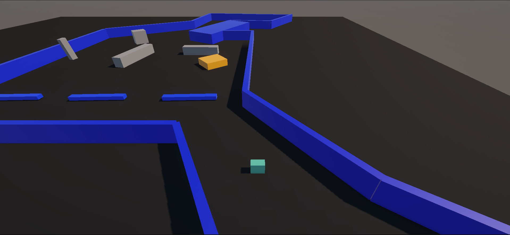
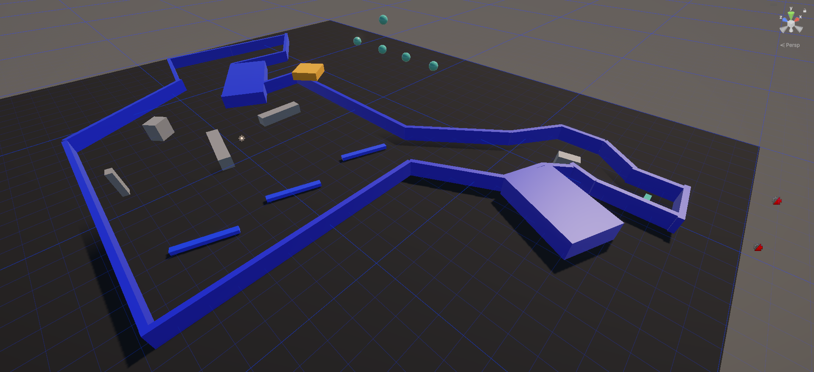
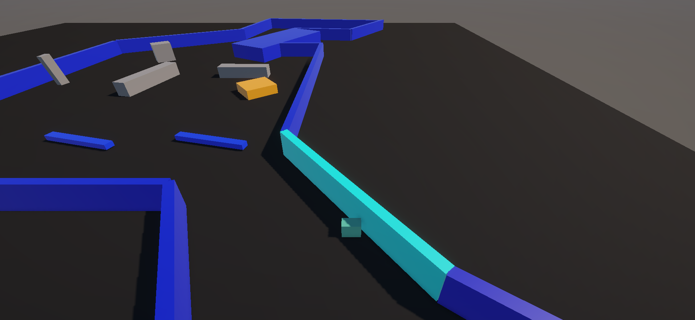

# ObstacleDodge

A 3D obstacle avoidance game developed in Unity 6 using C#.

## Overview

ObstacleDodge is the first project completed during my Unity game development journey. The game focuses on player movement, obstacle avoidance, collision detection, scoring systems, and core Unity gameplay programming concepts.

## Features

- Player Movement
- Obstacle Avoidance
- Collision Detection
- Score Tracking
- Hazard Systems
- Prefab Workflow
- Level Layout Design
- Game Over Conditions

## Technologies Used

- Unity 6
- C#
- Unity Physics
- Prefabs
- Collision Systems
- Cinemachine

## Screenshots

## Author

Bhavesh Kumar
